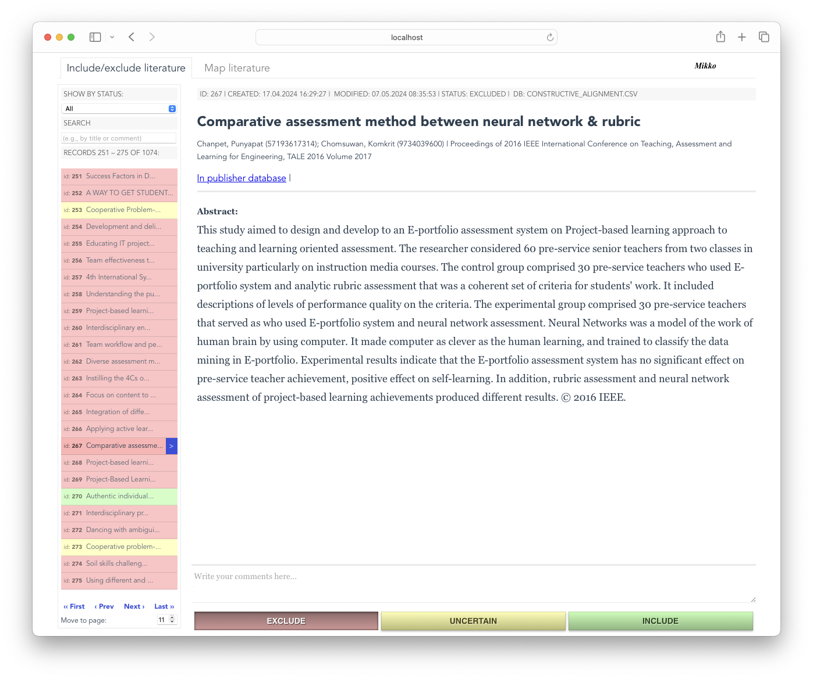

# mapping-study-toolbox

This repository is now a monorepo with:
- `server` side API (Express + Sequelize + sqlite + TypeScript)
- `ui/` frontend source (Vue 3 + Vite)
- separated runtime: backend API on `3000`, frontend on `8080`



## Quick start (Docker, recommended)
### 1. Clone the project
```
git clone https://github.com/kokkoniemi/mapping-study-toolbox.git
```
### 2. Start development stack
```shell
docker compose up --build
```

After the first build, normal startup is faster:
```shell
docker compose up
```

When `package-lock.json` (backend or `ui/`) changes, dependencies are automatically refreshed inside containers on next startup.

This starts:
- backend (auto-migrates sqlite and hot-reloads on backend file changes)
- frontend Vite dev server (hot-reloads on UI changes)
- if missing, `config/config.json` is created automatically from `config/config.example.json`

Open:
- UI (dev/HMR): http://localhost:8080
- API: http://localhost:3000/api
- sqlite DB file (default): `./db.sqlite3`

Useful commands:
```shell
docker compose down
docker compose logs -f
docker compose down -v   # also removes node_modules volumes
docker compose build     # rebuild images after dependency changes
```

Troubleshooting:
- If frontend reports missing module imports after adding dependencies, run:
  - `docker compose down -v && docker compose up --build`
- If API requests fail right after startup, wait for backend healthcheck and refresh once.

## Local (without Docker)

### System requirements
- node.js v24 LTS or above (you can use [nvm](https://github.com/nvm-sh/nvm))
- npm
- sqlite3

If you use nvm:
```shell
nvm install 24
nvm use 24
```

### Setup
1. Install backend dependencies:
```shell
npm install
```
2. Install UI dependencies:
```shell
npm run ui:install
```
3. Ensure DB config exists for runtime + migrations:
   - copy `config/config.example.json` to `config/config.json` and set sqlite path (`storage`)
4. Run local migrations:
```shell
npm run migrate
```
5. Start services:
```shell
npm start
npm run ui:dev
```

### Quality checks (recommended before commit)
```shell
npm run lint
npm run typecheck
npm test
npm run ui:typecheck
npm run ui:test
npm run ui:lint
npm run ui:build
```

### Init Sqlite database
This is safe and does not affect the existing data in the database.
```
npm run migrate
```

## Api and GUI

The backend (`server.ts`) exposes only the API at `http://localhost:3000/api`.
The frontend runs separately with Vite dev server.

GUI tabs:
- `Include/exclude literature`: focused classification flow
- `Map literature`: mapping questions/options flow
- `Data`: spreadsheet-like editable table for records and mapping assignments
  - built with Handsontable (`non-commercial-and-evaluation` license key in development)

### Run UI dev server
```shell
npm run ui:dev
```
UI dev server runs on http://localhost:8080 and calls backend API at http://localhost:3000/api/.

### Data tab backend endpoint
- `PATCH /api/records/:id` for partial record updates used by the Data tab.
- `POST /api/records/enrichment-jobs` to start bulk Crossref enrichment for selected record IDs.
- `GET /api/records/enrichment-jobs/:jobId` to poll job progress/results.
  - compact polling supported via `compact=1&resultCursor=<n>&updatedCursor=<n>` (delta payloads)
- `POST /api/records/enrichment-jobs/:jobId/cancel` to stop queued/running enrichment jobs.

### Crossref + OpenAlex enrichment
- In the `Data` tab, select rows (leftmost checkbox column), choose service (`Crossref`, `OpenAlex`, or `Crossref + OpenAlex`), then click `Enrich selected`.
- Default service is `Crossref + OpenAlex`.
- You can stop a running job with the `Stop` button (cancels after the current record finishes).
- `Force refresh` bypasses freshness windows for both Crossref and OpenAlex and re-fetches metadata.
- Enrichment updates record DOI/author details/references and forum metadata (`publisher`, `issn`, `jufoLevel` when found).
- OpenAlex enrichment updates:
  - citation count
  - citation list (title/doi/link/year/forum)
  - topic list
  - author affiliations
- Reference list comes from Crossref only.
- Reference titles are backfilled from Crossref by DOI when missing (bounded by `CROSSREF_REFERENCE_TITLE_LOOKUP_MAX`, default `12` lookups per record).
- During processing, the status panel shows per-API counters:
  - records processed via Crossref/OpenAlex/JUFO
  - request counts sent to Crossref/OpenAlex/JUFO
- Queue controls:
  - queue size limit (`ENRICHMENT_MAX_QUEUED_JOBS`, default `20`)
  - per-job record limit (`ENRICHMENT_MAX_RECORDS_PER_JOB`, default `500`)
- DOI detection order:
  1. try extracting DOI from `url` / `alternateUrls`
  2. fallback to Crossref title + author search
- JUFO lookup:
  - if forum ISSN is available, service does `etsi.php?issn=...` then resolves `/kanava/{id}` for level
  - JUFO requests are throttled with low concurrency and respectful pacing
- Rate-limit handling:
  - requests are throttled
  - `429` / `503` responses use backoff + retry (`Retry-After` honored when provided)
- Optional env vars:
  - `CROSSREF_BASE_URL` (default `https://api.crossref.org`)
  - `CROSSREF_MAILTO` (recommended contact email for Crossref requests)
  - `CROSSREF_REFERENCE_TITLE_LOOKUP_MAX` (default `12`)
  - `CROSSREF_REFRESH_MS` (default `30 days`)
  - `OPENALEX_BASE_URL` (default `https://api.openalex.org`)
  - `OPENALEX_API_KEY` (required for OpenAlex access)
  - `OPENALEX_MIN_DELAY_MS` (default `250`)
  - `OPENALEX_MAX_DELAY_MS` (default `800`)
  - `OPENALEX_REFRESH_MS` (default `30 days`)
  - `OPENALEX_MAX_CITATIONS` (optional hard cap; default `5000`)
  - `JUFO_BASE_URL` (default `https://jufo-rest.csc.fi/v1.1`)
  - `JUFO_MIN_DELAY_MS` (default `500`)
  - `JUFO_MAX_DELAY_MS` (default `1000`)
  - `CORS_ALLOWED_ORIGINS` (comma-separated list, default `http://localhost:8080,http://localhost:3000`)
  - `REQUEST_BODY_LIMIT` (default `1mb`)
  - `ENRICHMENT_RATE_LIMIT_MAX_REQUESTS` (default `20`)
  - `ENRICHMENT_RATE_LIMIT_WINDOW_MS` (default `60000`)
  - `ENRICHMENT_MAX_QUEUED_JOBS` (default `20`)
  - `ENRICHMENT_MAX_RECORDS_PER_JOB` (default `500`)
  - `RECORD_LIST_LIMIT_MAX` (default `250`)

### Where to put `OPENALEX_API_KEY`
- Docker: add `OPENALEX_API_KEY` under `services.backend.environment` in `docker-compose.yml` (or use `${OPENALEX_API_KEY}` with a local `.env` file).
- Local non-docker: export env var before starting backend, for example:
```shell
export OPENALEX_API_KEY='your-key-here'
npm start
```
- Do not commit secrets into git-tracked files.

### Build UI for deployment/static hosting
```shell
npm run ui:build
```
This outputs static files to `ui/dist`.

### UI tests and type safety
```shell
npm run ui:typecheck
npm run ui:test
```

## CI
- GitHub Actions workflow: `.github/workflows/ci.yml`
- Runs backend and frontend checks on pushes and pull requests:
  - `npm run lint`
  - `npm run typecheck`
  - `npm test`
  - `npm run ui:typecheck`
  - `npm run ui:test`
  - `npm run ui:build`
